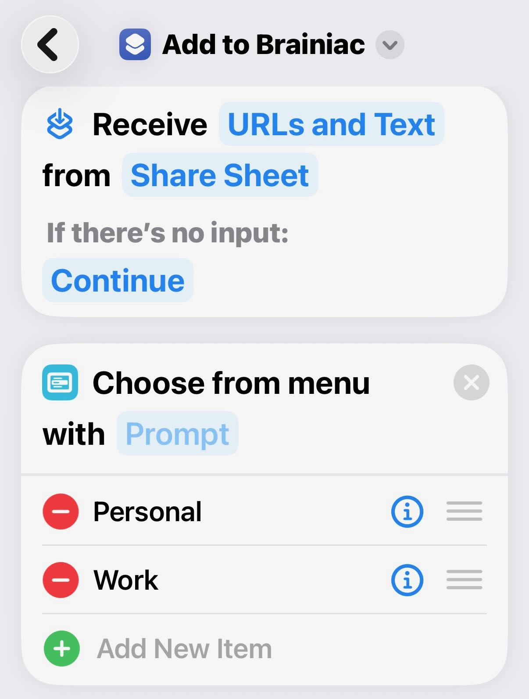
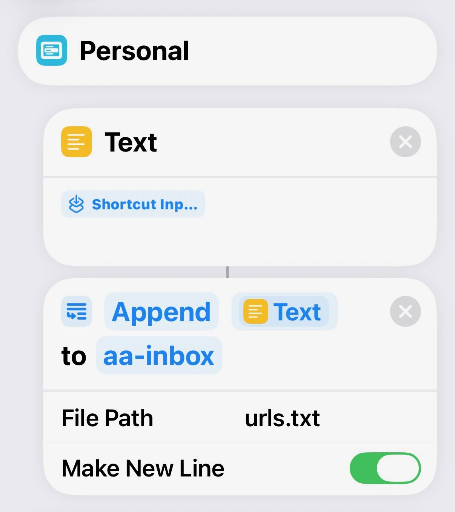
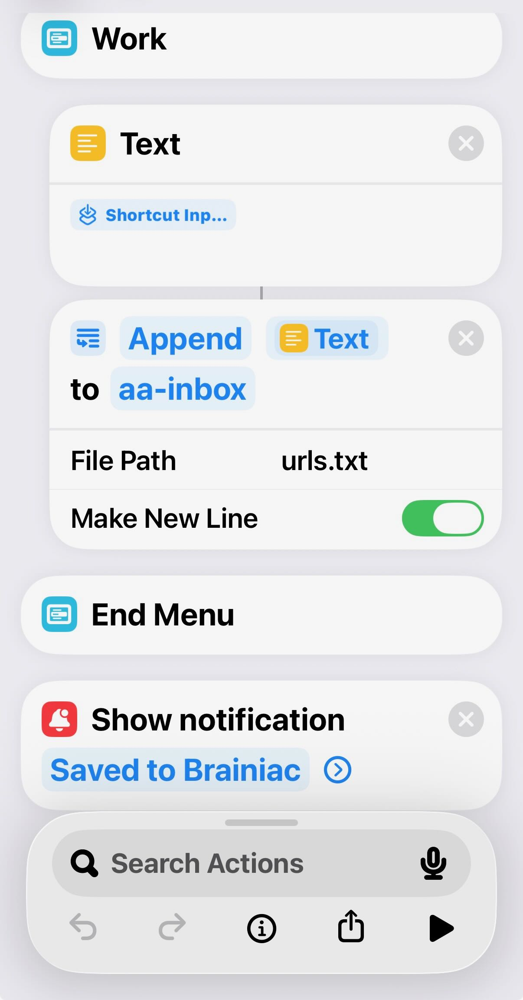
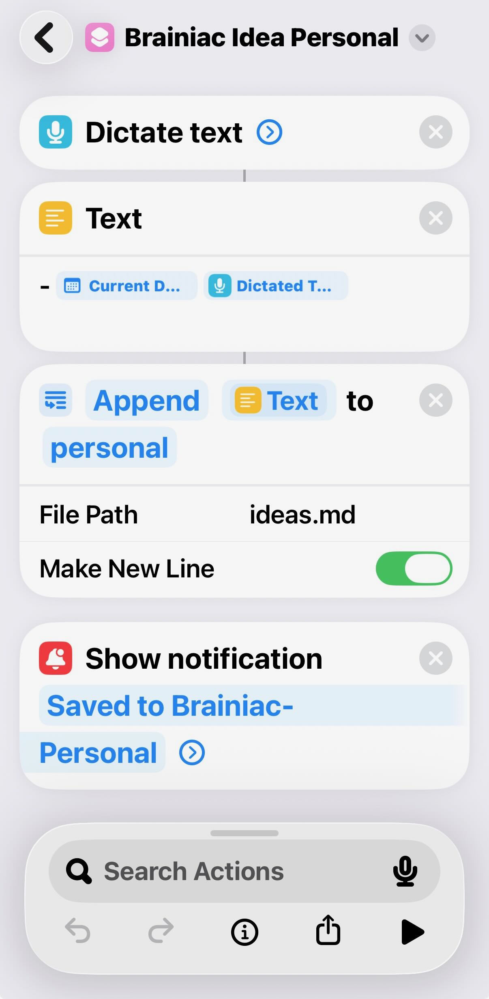
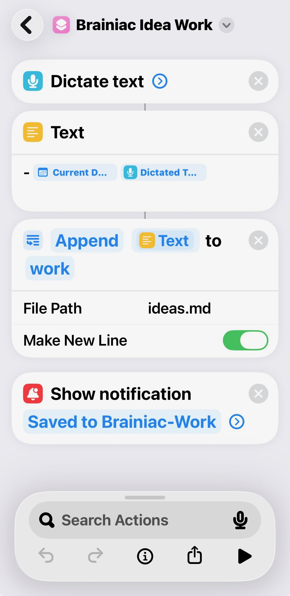

# iOS Shortcuts

Three Apple Shortcuts provide the frictionless capture in Layer 2.1 — one share-sheet URL drop and two voice "idea" shortcuts. They're small enough to **rebuild by hand from the screenshots below** (no import needed). Every action is a stock Shortcuts action; the only thing you customize is the file path.

> **These screenshots are the reference build**, named "Brainiac" with `personal`/`work` vaults. Swap in your own knowledge-base name and vault/folder names as you go. The mechanics are identical regardless of what you call things.

> **Why file paths, not variables:** each "Append to Text File" action points at a real file inside your synced vault (iCloud in the reference; OneDrive/Dropbox work the same). The single most common breakage is the file picker silently landing on the wrong path — always re-check it points **inside `aa-inbox/`** (for URLs) or at the vault root (for `ideas.md`). See BUILD-GUIDE §2.1.

| Shortcut | Trigger | Appends to |
|---|---|---|
| **Add to Brainiac** | Share Sheet (any app) | `<vault>/aa-inbox/urls.txt` |
| **Brainiac Idea (Personal)** | Siri voice | `personal/ideas.md` |
| **Brainiac Idea (Work)** | Siri voice | `work/ideas.md` |

---

## 1. Add to Brainiac (share-sheet URL drop)

Receives a URL/text from any app's Share Sheet, asks **Personal or Work?**, and appends the URL as a new line to that vault's `aa-inbox/urls.txt`.

**Actions, top to bottom:**

1. **Receive** `URLs and Text` from **Share Sheet** — *If there's no input: Continue*.
2. **Choose from Menu** with prompt → two items: **Personal** and **Work**.
3. Under **each** menu branch:
   - **Text** = `Shortcut Input` (the shared URL).
   - **Append** that Text **to** the vault's `aa-inbox` folder → **File Path:** `urls.txt`, **Make New Line:** ON.
4. **Show Notification** → "Saved to Brainiac".

| Menu + Share Sheet | Personal branch | Work branch + notify |
|---|---|---|
|  |  |  |

> The two branches are identical except for which vault's `aa-inbox` they target. Point each "Append to Text File" at the matching vault → `aa-inbox` → `urls.txt`.

---

## 2. Brainiac Idea (Personal) — voice capture

Dictate a thought; it's timestamped and appended to `personal/ideas.md`. Because the **shortcut's name is the Siri phrase**, saying *"Hey Siri, Brainiac Idea Personal"* runs it hands-free.

**Actions, top to bottom:**

1. **Dictate Text**.
2. **Text** = `- ` + **Current Date** + ` ` + **Dictated Text** (produces a line like `- <date> <your idea>`).
3. **Append** that Text **to** the `personal` folder → **File Path:** `ideas.md`, **Make New Line:** ON.
4. **Show Notification** → "Saved to Brainiac-Personal".

---

## 3. Brainiac Idea (Work) — voice capture

Identical to the Personal version, but appends to `work/ideas.md` and confirms "Saved to Brainiac-Work". Duplicate the Personal shortcut, rename it (the new name becomes its Siri phrase), and repoint the append to the `work` vault.

---

## Notes

- **The name is the Siri phrase.** iOS no longer records a separate custom phrase — rename the shortcut to change what you say to Siri.
- **URL drops only work for public URLs.** Login-gated content can't be fetched later — use the Web Clipper (BUILD-GUIDE §2.3) for those.
- **Prefer to import rather than rebuild?** These are stock actions, so rebuilding takes ~2 minutes each. If you'd rather share importable versions, export your own from the Shortcuts app (Share → Export) and drop the `.shortcut` files here alongside the screenshots.
